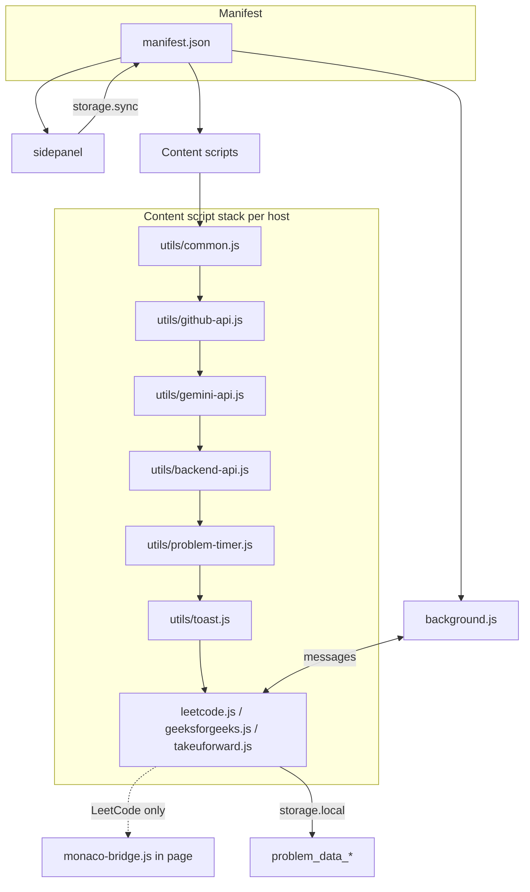

# Extension Architecture

This document describes the high-level architecture of the Traverse (LeetFeedback) Chrome extension: how the manifest wires components, script load order, roles of each part, storage usage, and web-accessible resources.

## Manifest and injection

The extension is defined in **`manifest.json`** (Manifest V3).

- **Background**: Single service worker `background.js` — handles side panel behavior, message routing, and CORS/GFG solution extraction.
- **Side panel**: Opens when the user clicks the extension icon; entry is `sidepanel/sidepanel.html`.
- **Content scripts**: Injected per host. Scripts run in this **exact order** (shared utils first, then platform script):

  1. `utils/common.js`
  2. `utils/github-api.js`
  3. `utils/gemini-api.js`
  4. `utils/backend-api.js`
  5. `utils/problem-timer.js`
  6. `utils/toast.js`
  7. Platform script: `content-scripts/leetcode.js` | `content-scripts/geeksforgeeks.js` | `content-scripts/takeuforward.js`

- **Match patterns**:
  - LeetCode: `https://*.leetcode.com/*`
  - GeeksforGeeks: `https://*.geeksforgeeks.org/*`, `https://practice.geeksforgeeks.org/*`
  - TakeUForward: `https://*.takeuforward.org/*`

- **Run at**: `document_end` for all content scripts.

## Component roles

| Component | Role |
|-----------|------|
| **background.js** | Side panel open-on-click; message handler for `getUserSolution` (GFG), `testGitHubConnection`, `initializeConfig`, `CONTENT_SCRIPT_READY`, `BACKEND_API_FETCH`; session/timer flags on install/startup. |
| **sidepanel/** | Config (GitHub token/repo/branch, Gemini key, debug), auth (login/register via extensionAuth), settings (GitHub push toggle, timer overlay, debug); session status; update check (GitHub releases). |
| **Content scripts** | Page-specific: extract problem info, track run/submit, persist per-problem state, optionally run Gemini analysis, push to backend and optionally to GitHub. LeetCode also injects the Monaco bridge. |

## Storage

- **`chrome.storage.sync`**: User settings — GitHub token, owner, repo, branch; Gemini API key; `debug_mode`; `github_push_enabled`; `timer_overlay_enabled`. Synced across devices when user is signed into Chrome.
- **`chrome.storage.local`**: Per-tab/problem and auth data — `problem_data_<problemSlug>` (problem metadata, attempts, counters, timer fields, AI analysis); `auth_token`, `auth_user`, `auth_timestamp`; `timer_overlay_position`; `browser_session_restarted`, `session_start_time`; `update_check_cache`.

## Web-accessible resources

Declared in `manifest.json` under `web_accessible_resources` (matches `<all_urls>`):

- **`utils/interceptor.js`** — Available for injection into page context if needed.
- **`utils/monaco-bridge.js`** — Injected by the LeetCode content script into the page so it can read LeetCode’s Monaco editor (same origin as the page). The content script talks to it via `window.postMessage`.

## High-level diagram

