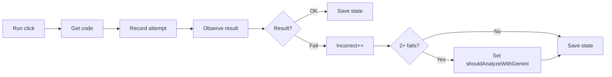
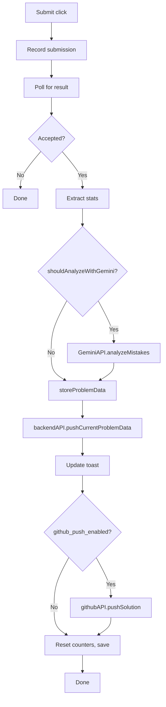

# Workflows and message flows

This document describes the main **user and data flows** (workflows) and **message passing** (“chats”) between the extension’s parts. The extension does not expose separate “workflows” or “chats” as product features; here “workflows” are sequences of actions and data (e.g. solve → sync), and “chats” are message exchanges (e.g. content script ↔ background, content script ↔ Monaco bridge).

---

## Page load (e.g. LeetCode problem page)

1. Content scripts load in order: common → github-api → gemini-api → backend-api → problem-timer → toast → platform script (e.g. `leetcode.js`).
2. Platform script initializes: load persisted state from `problem_data_<currentUrl>` (if any).
3. Initialize GitHub API and Backend API (tokens from storage).
4. **LeetCode only**: Inject `monaco-bridge.js` into the page and set up `postMessage` listener for bridge responses.
5. Set up event listeners: URL observer, submit button, run button (and ProblemTimer visibility if applicable).
6. Detect current problem URL; if it changed from last stored URL, reset counters and clear/reset problem data for the new problem.
7. Start the unified problem timer for the current URL (`ProblemTimer.getInstance().startTimer(currentUrl)`).
8. Extract problem info (title, difficulty, topics, etc.) and store as unsolved if first visit.

---

## Run button flow

1. User clicks **Run** on the platform (e.g. LeetCode).
2. Content script handler runs: get current code (via Monaco bridge on LeetCode, or editor fallbacks elsewhere) and language.
3. Increment run counter; push an attempt object `{ code, language, timestamp, type: 'run', runNumber, successful: null }` and persist state.
4. Observe DOM (and/or poll) for run result (e.g. “Accepted”, “Wrong answer”, “Runtime error”).
5. On result:
   - **Success**: set `attempt.successful = true`, save state.
   - **Failure**: set `attempt.successful = false`, increment incorrect-run counter, save state. If incorrect runs reach threshold (e.g. 2+), call platform-specific handler (e.g. `handleThreeIncorrectRuns`) to set `shouldAnalyzeWithGemini = true` for the next successful submit.

---

## Submit button flow

1. User clicks **Submit**.
2. Content script records submission attempt (code, language, timestamp, type `'submit'`, submission number), sets `submissionInProgress`, persists.
3. Poll (or observe) for submission result in the DOM (e.g. “Accepted” vs “Wrong answer” / “Runtime error” / etc.).
4. When result is detected:
   - **Not accepted**: set `attempt.successful = false`, clear `submissionInProgress`, save; done.
   - **Accepted**: proceed to successful-submission pipeline below.

### Successful submission pipeline

1. Wait briefly for performance stats to appear, then extract them (runtime, memory, etc.).
2. Extract full problem info again (title, description, difficulty, topics, code, etc.).
3. **If `shouldAnalyzeWithGemini`**: call `GeminiAPI.analyzeMistakes(attempts, problemInfo)`; store `aiAnalysis` and `aiTags` on the extractor and in problem data.
4. Call `storeProblemData(problemInfo, true, totalTries)` so `problem_data_<url>` in local storage is updated with solved state, attempts, AI data, and timer fields.
5. Show toast “Analyzing solution...” (no auto-dismiss).
6. **Backend push**: `backendAPI.pushCurrentProblemData(currentUrl)` (reads from storage). On success/error, update toast (e.g. “Solution synced to Traverse!” or “Sync failed: …”).
7. **GitHub push** (if enabled in settings): `githubAPI.pushSolution(problemInfo, PLATFORM)`. On success, reset run/submit counters and clear Gemini-related state; save state.
8. If GitHub push is disabled, still reset counters and save state.

---

## Sidepanel workflows

- **Config tab**: On load, read from `chrome.storage.sync` (token, owner, repo, branch, Gemini key, debug, GitHub push, timer overlay). On input change, debounced save back to sync storage; refresh connection status and auth summary.
- **Auth**: Login form submits to `extensionAuth.login()`. Register button opens external site (e.g. leet-feedback.vercel.app/login). Auth status is cached in local storage (`auth_user`, `auth_token`, `auth_timestamp`) and reflected in the sidepanel (profile card or login form). Sign out clears auth and updates UI.
- **Settings**: Toggles for “Push to GitHub”, “Timer overlay”, “Debug mode” write to sync storage and are read by content scripts / background as needed.
- **Update check**: On load, optionally fetch GitHub latest release (throttled, e.g. once per day); compare version to manifest; show “Download Update” or “Up to date” in the sidepanel.
- **Session status**: Decode JWT (if present) for expiration; show “Active”, “Expires in Xh”, or “Session expired” and optional “Login again” / “Refresh session” actions.

---

## Message “chats”

### Content script → Background

| Message type | Purpose | Response |
|--------------|---------|----------|
| `getUserSolution` | GeeksforGeeks: get current solution from page (background injects `extractGfGSolution` into tab) | `{ success, solution }` |
| `testGitHubConnection` | Verify GitHub token with `GET https://api.github.com/user` | `{ success, user }` or `{ success: false, error }` |
| `initializeConfig` | Get token, owner, repo, branch, geminiApiKey from sync storage | `{ success, config }` |
| `CONTENT_SCRIPT_READY` | Notify that content script is ready (e.g. URL) | `{ success: true }` |
| `BACKEND_API_FETCH` | Bypass CORS: background performs `fetch(url, options)` and returns result | `{ success, status, data }` or `{ success: false, error }` |

### Page ↔ Content script (LeetCode Monaco bridge)

The LeetCode content script injects `utils/monaco-bridge.js` into the **page** context. The bridge runs in the same world as LeetCode’s Monaco editor. Communication is via `window.postMessage`:

| Direction | Message | Meaning |
|-----------|---------|---------|
| Content → Page | `{ source: 'LeetFeedback', type: 'LEETFEEDBACK_REQUEST_CODE', requestId }` | Request current code and language from Monaco. |
| Page → Content | `{ source: 'LeetFeedback', type: 'LEETFEEDBACK_BRIDGE_READY' }` | Bridge loaded and ready. |
| Page → Content | `{ source: 'LeetFeedback', type: 'LEETFEEDBACK_CODE', requestId, code, language }` | Response for the given `requestId`. |

The content script uses a timeout (e.g. 1200 ms) when waiting for `LEETFEEDBACK_CODE`; if no response, it falls back to other methods (e.g. global `monaco.editor` if available, or DOM scrape).
